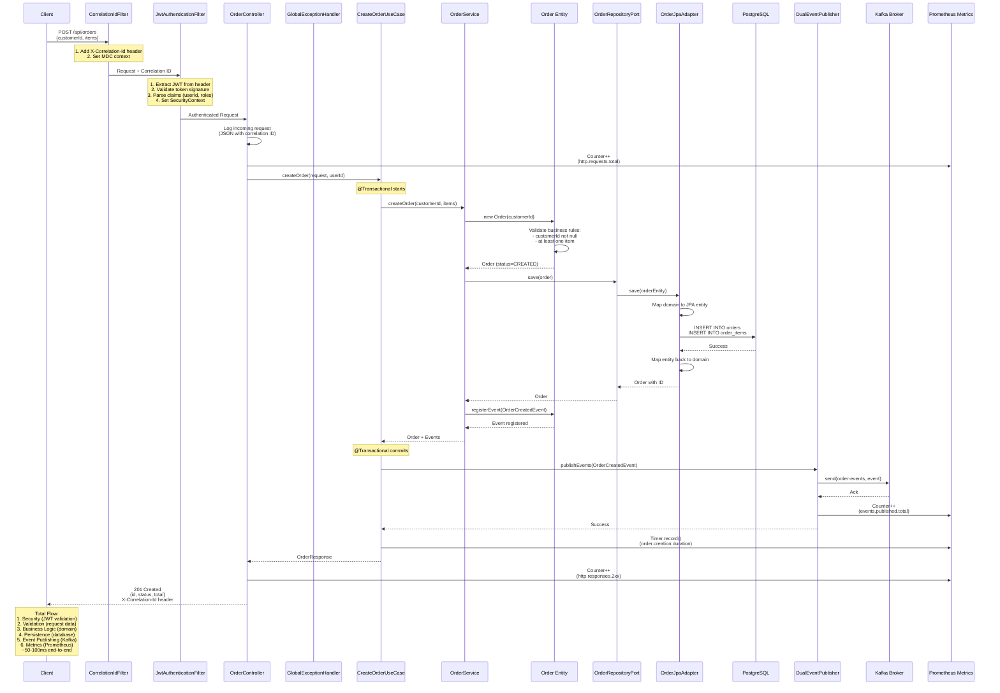
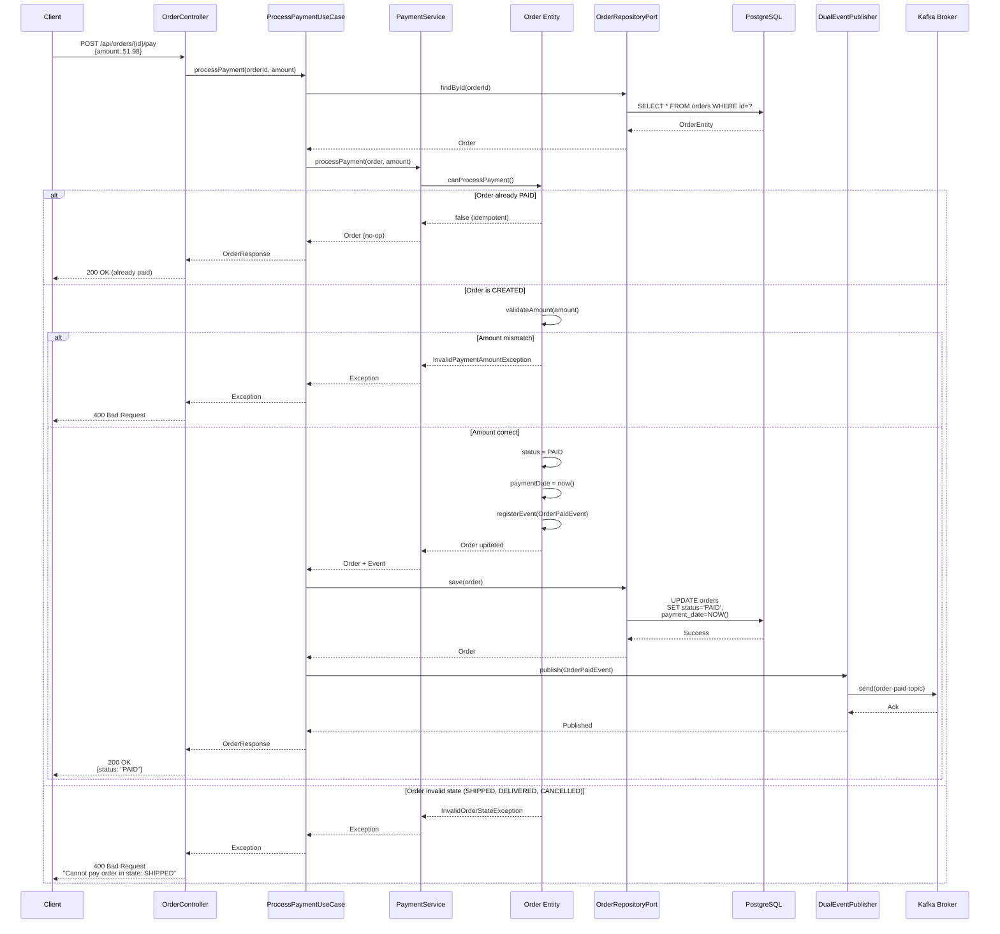
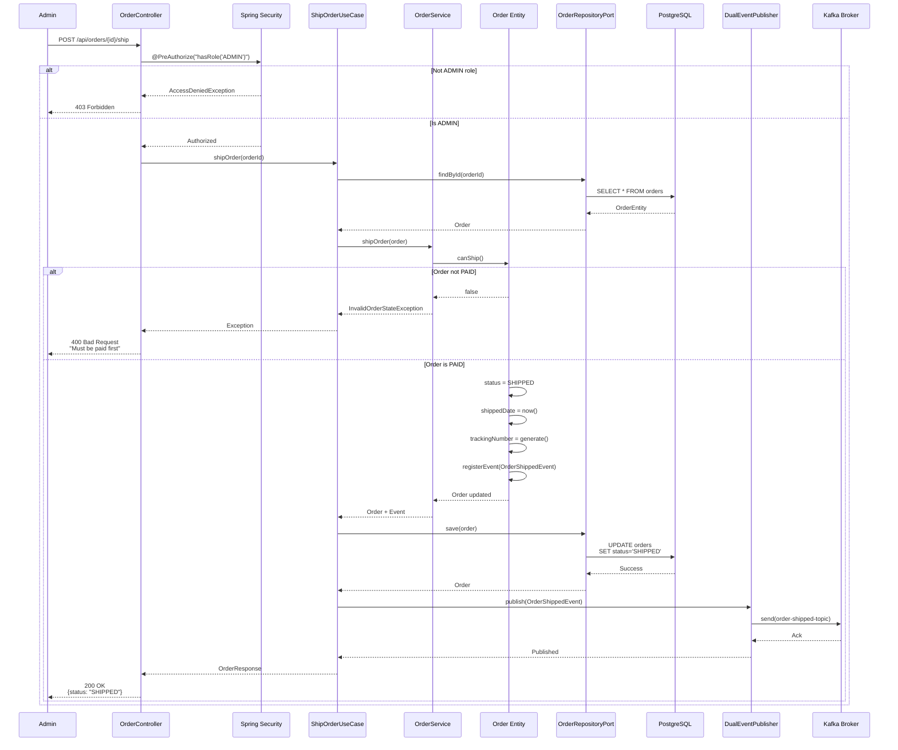
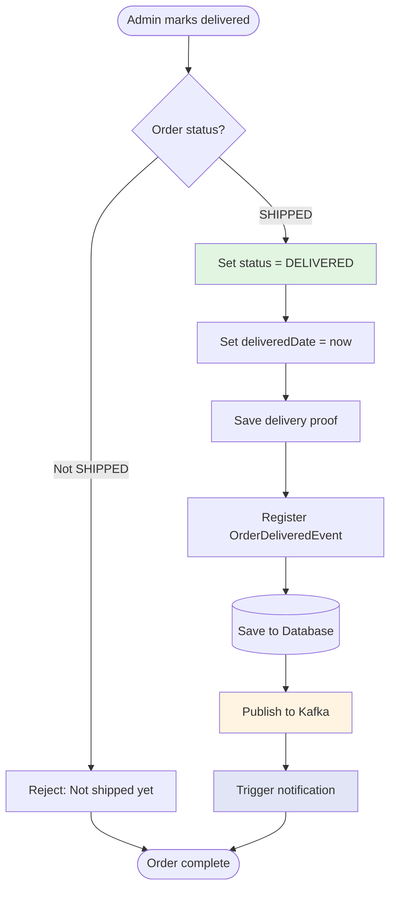
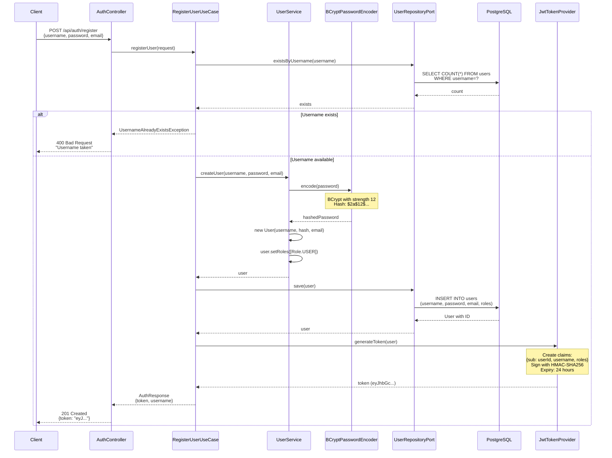
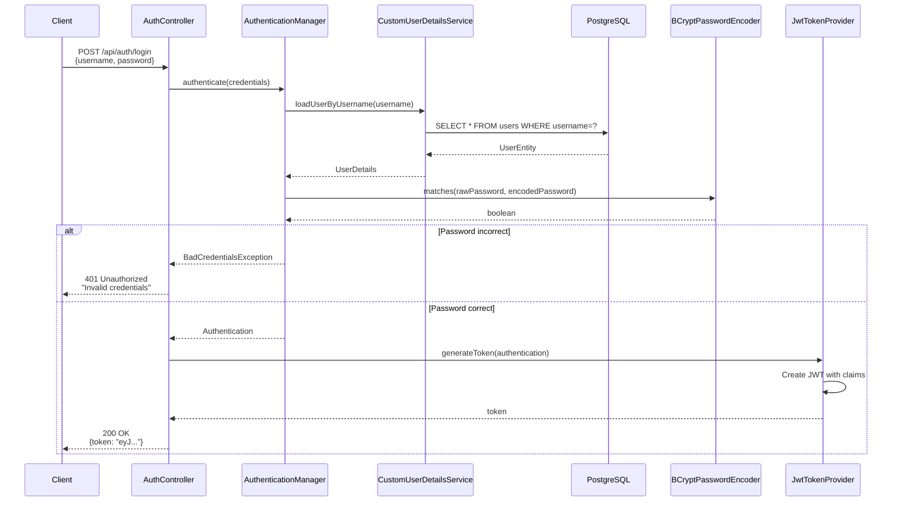
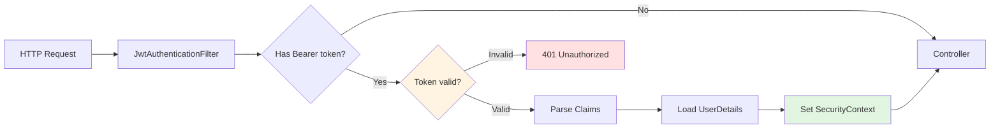
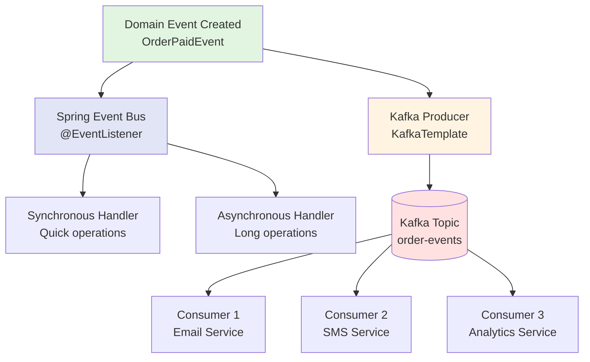

# Comprehensive Data Flow Documentation

**Order Fulfillment & Notification System**  
**Last Updated:** December 26, 2025  
**Status:** Production-Ready System

---

## 📋 Table of Contents

1. [System Overview](#system-overview)
2. [Complete Request Flow](#complete-request-flow)
3. [Order Creation Flow](#order-creation-flow)
4. [Payment Processing Flow](#payment-processing-flow)
5. [Order Shipping Flow](#order-shipping-flow)
6. [Order Delivery Flow](#order-delivery-flow)
7. [Authentication Flow](#authentication-flow)
8. [Event-Driven Notification Flow](#event-driven-notification-flow)
9. [Query Operations Flow](#query-operations-flow)
10. [Error Handling Flow](#error-handling-flow)
11. [Data Transformation Pipeline](#data-transformation-pipeline)
12. [Cross-Cutting Concerns](#cross-cutting-concerns)
13. [Performance & Optimization](#performance-optimization)

---

## System Overview

The Order Fulfillment System implements a multi-layered architecture with clear data flow through:

```
┌─────────────────────────────────────────────────────────────┐
│                    External Clients                          │
│              (Browser, Mobile App, API Client)               │
└─────────────────────────────────────────────────────────────┘
                            ↓ HTTP/REST
┌─────────────────────────────────────────────────────────────┐
│                  Presentation Layer                          │
│  • REST Controllers (OrderController, AuthController)        │
│  • Request Validation                                        │
│  • JWT Authentication Filter                                 │
│  • Global Exception Handler                                  │
└─────────────────────────────────────────────────────────────┘
                            ↓ DTOs
┌─────────────────────────────────────────────────────────────┐
│                  Application Layer                           │
│  • Use Cases (CreateOrder, ProcessPayment, etc.)             │
│  • Transaction Boundaries                                    │
│  • Event Publishing Coordination                             │
└─────────────────────────────────────────────────────────────┘
                            ↓ Commands
┌─────────────────────────────────────────────────────────────┐
│                    Domain Layer                              │
│  • Business Logic (Order, User entities)                     │
│  • Domain Services (OrderService, PaymentService)            │
│  • Domain Events (OrderCreatedEvent, OrderPaidEvent)         │
│  • Business Rule Validation                                  │
└─────────────────────────────────────────────────────────────┘
                            ↓ Ports
┌─────────────────────────────────────────────────────────────┐
│                 Infrastructure Layer                         │
│  • JPA Adapters (OrderJpaAdapter, UserJpaAdapter)            │
│  • Kafka Publishers (NotificationPublisher)                  │
│  • Event Publishers (OrderEventPublisher)                    │
└─────────────────────────────────────────────────────────────┘
                            ↓
┌─────────────────────────────────────────────────────────────┐
│              External Systems & Storage                      │
│  • PostgreSQL Database                                       │
│  • Apache Kafka (Message Broker)                             │
│  • Prometheus (Metrics)                                      │
└─────────────────────────────────────────────────────────────┘
```

---

## Complete Request Flow

### End-to-End Request Journey (Create Order Example)



---

## Order Creation Flow

### Detailed Step-by-Step Breakdown

#### **Phase 1: Request Reception & Authentication**

```
1. HTTP POST /api/orders arrives at server
   Headers: 
   - Authorization: Bearer eyJhbGc...
   - Content-Type: application/json
   
   Body:
   {
     "customerId": "customer-123",
     "items": [
       {"productId": "prod-1", "quantity": 2, "price": 25.99}
     ]
   }

2. CorrelationIdFilter intercepts request
   - Checks for existing X-Correlation-Id header
   - If missing, generates new UUID
   - Sets MDC context: MDC.put("correlationId", id)
   - All subsequent logs include correlation ID
   
3. JwtAuthenticationFilter intercepts request
   - Extracts token from Authorization header
   - Validates JWT signature with secret key
   - Parses claims: {userId: "user-123", roles: ["USER"]}
   - Creates Authentication object
   - Sets SecurityContextHolder.getContext().setAuthentication(auth)
   - If invalid: throws JwtException → 401 Unauthorized
```

#### **Phase 2: Controller Layer Processing**

```java
@RestController
@RequestMapping("/api/orders")
@Slf4j
public class OrderController {
    
    @PostMapping
    public ResponseEntity<OrderResponse> createOrder(
            @Valid @RequestBody CreateOrderRequest request,
            @AuthenticationPrincipal UserDetails user) {
        
        // 1. Log incoming request (with correlation ID from MDC)
        log.info("Creating order for customer: {}", request.getCustomerId());
        
        // 2. Extract authenticated user ID
        String userId = user.getUsername();
        
        // 3. Delegate to use case
        Order order = createOrderUseCase.execute(request, userId);
        
        // 4. Map domain to DTO
        OrderResponse response = OrderMapper.toResponse(order);
        
        // 5. Return with 201 Created
        return ResponseEntity.status(HttpStatus.CREATED).body(response);
    }
}
```

**Data Transformation:**
```
CreateOrderRequest (DTO)
    ↓ Controller validation (@Valid)
    ↓ Check: customerId not blank
    ↓ Check: items list not empty
    ↓ Check: each item has valid price/quantity
    ↓ If invalid: MethodArgumentNotValidException → 400 Bad Request
    ↓
CreateOrderCommand (Application Layer)
```

#### **Phase 3: Application Layer - Use Case Execution**

```java
@Service
@Transactional
public class CreateOrderUseCase {
    
    private final OrderService orderService;
    private final OrderRepositoryPort orderRepository;
    private final DualEventPublisher eventPublisher;
    
    public Order execute(CreateOrderRequest request, String userId) {
        // 1. Map DTO to domain command
        List<OrderItem> items = request.getItems().stream()
            .map(dto -> new OrderItem(dto.getProductId(), dto.getQuantity(), dto.getPrice()))
            .toList();
        
        // 2. Invoke domain service
        Order order = orderService.createOrder(request.getCustomerId(), items);
        
        // 3. Persist order (transaction boundary)
        Order savedOrder = orderRepository.save(order);
        
        // 4. Collect domain events
        List<DomainEvent> events = savedOrder.getDomainEvents();
        
        // 5. Publish events (after transaction commits)
        eventPublisher.publish(events);
        
        // 6. Return domain entity
        return savedOrder;
    }
}
```

**Transaction Boundaries:**
```
@Transactional starts
    ↓ saveOrder() - INSERT orders
    ↓ saveOrderItems() - INSERT order_items (cascaded)
    ↓ Transaction commits (all or nothing)
    ↓ If failure: rollback, throw exception
@Transactional ends

THEN (after commit):
    ↓ publishEvents() - Kafka publishing
    ↓ Non-transactional (best effort)
    ↓ If Kafka fails: retry with @Retryable
```

#### **Phase 4: Domain Layer - Business Logic**

```java
@Entity
@Table(name = "orders")
public class Order {
    
    @Id
    @GeneratedValue(strategy = GenerationType.UUID)
    private String id;
    
    private String customerId;
    
    @Enumerated(EnumType.STRING)
    private OrderStatus status;
    
    @OneToMany(mappedBy = "order", cascade = CascadeType.ALL, orphanRemoval = true)
    private List<OrderItem> items = new ArrayList<>();
    
    @Transient
    private List<DomainEvent> domainEvents = new ArrayList<>();
    
    // Business logic
    public void addItem(OrderItem item) {
        // Validation
        if (item == null) {
            throw new InvalidOrderException("Order item cannot be null");
        }
        if (item.getQuantity() <= 0) {
            throw new InvalidOrderException("Item quantity must be positive");
        }
        if (item.getPrice().compareTo(BigDecimal.ZERO) <= 0) {
            throw new InvalidOrderException("Item price must be positive");
        }
        
        // Business rule
        items.add(item);
        item.setOrder(this);
        
        // Calculate total
        recalculateTotal();
    }
    
    public void markAsCreated() {
        this.status = OrderStatus.CREATED;
        this.createdDate = LocalDateTime.now();
        
        // Register domain event
        registerEvent(new OrderCreatedEvent(this.id, this.customerId, this.totalAmount));
    }
    
    private void registerEvent(DomainEvent event) {
        this.domainEvents.add(event);
    }
}
```

**Business Rules Enforced:**
- ✅ Customer ID required
- ✅ At least one item required
- ✅ Item quantity > 0
- ✅ Item price > 0
- ✅ Total calculated automatically
- ✅ Status transitions validated
- ✅ Domain events registered for state changes

#### **Phase 5: Persistence Layer - Database Operations**

```java
@Repository
public class OrderJpaAdapter implements OrderRepositoryPort {
    
    private final OrderJpaRepository jpaRepository;
    
    @Override
    public Order save(Order order) {
        // 1. Map domain entity to JPA entity
        OrderEntity entity = OrderEntityMapper.toEntity(order);
        
        // 2. Save to database (JPA handles cascading)
        OrderEntity savedEntity = jpaRepository.save(entity);
        
        // 3. Map back to domain entity
        Order savedOrder = OrderEntityMapper.toDomain(savedEntity);
        
        // 4. Preserve domain events
        savedOrder.setDomainEvents(order.getDomainEvents());
        
        return savedOrder;
    }
}
```

**Database Operations:**
```sql
-- Transaction begins

-- 1. Insert order
INSERT INTO orders (id, customer_id, status, total_amount, created_date)
VALUES ('order-uuid', 'customer-123', 'CREATED', 51.98, NOW());

-- 2. Insert order items (cascaded)
INSERT INTO order_items (id, order_id, product_id, quantity, price)
VALUES 
  ('item-1-uuid', 'order-uuid', 'prod-1', 2, 25.99);

-- Transaction commits
```

**Indexes Used:**
```sql
-- Primary key lookup
CREATE INDEX idx_orders_id ON orders(id);

-- Customer queries
CREATE INDEX idx_orders_customer_id ON orders(customer_id);

-- Status-based queries
CREATE INDEX idx_orders_status ON orders(status);

-- Date range queries
CREATE INDEX idx_orders_created_date ON orders(created_date);
```

#### **Phase 6: Event Publishing - Kafka Integration**

```java
@Component
public class DualEventPublisher {
    
    private final ApplicationEventPublisher springEventPublisher;
    private final KafkaEventPublisher kafkaEventPublisher;
    
    public void publish(List<DomainEvent> events) {
        events.forEach(event -> {
            // 1. Publish to Spring Event Bus (synchronous)
            springEventPublisher.publishEvent(event);
            
            // 2. Publish to Kafka (asynchronous)
            kafkaEventPublisher.publish(event);
        });
    }
}

@Component
public class KafkaEventPublisher {
    
    private final KafkaTemplate<String, DomainEvent> kafkaTemplate;
    
    @Retryable(
        retryFor = KafkaException.class,
        maxAttempts = 3,
        backoff = @Backoff(delay = 1000, multiplier = 2)
    )
    @CircuitBreaker(name = "kafka", fallbackMethod = "publishFallback")
    public void publish(DomainEvent event) {
        String topic = determineTopicForEvent(event);
        String key = event.getAggregateId();
        
        // Send to Kafka with callback
        ListenableFuture<SendResult> future = kafkaTemplate.send(topic, key, event);
        
        future.addCallback(
            result -> log.info("Event published: {} to topic: {}", event.getClass().getSimpleName(), topic),
            ex -> log.error("Failed to publish event: {}", event, ex)
        );
    }
    
    private void publishFallback(DomainEvent event, Exception ex) {
        log.error("Circuit breaker OPEN: Failed to publish event after retries: {}", event, ex);
        // Store in dead-letter queue or database for manual retry
    }
}
```

**Kafka Message Format:**
```json
{
  "eventType": "OrderCreatedEvent",
  "aggregateId": "order-uuid",
  "aggregateType": "Order",
  "timestamp": "2025-12-26T10:30:00Z",
  "payload": {
    "orderId": "order-uuid",
    "customerId": "customer-123",
    "totalAmount": 51.98,
    "itemCount": 1
  },
  "metadata": {
    "correlationId": "correlation-uuid",
    "userId": "user-123",
    "version": 1
  }
}
```

#### **Phase 7: Response Mapping & Return**

```java
// Controller
OrderResponse response = OrderMapper.toResponse(order);

// OrderMapper
public static OrderResponse toResponse(Order order) {
    return OrderResponse.builder()
        .id(order.getId())
        .customerId(order.getCustomerId())
        .status(order.getStatus().name())
        .totalAmount(order.getTotalAmount())
        .items(order.getItems().stream()
            .map(OrderMapper::toItemResponse)
            .toList())
        .createdDate(order.getCreatedDate())
        .build();
}
```

**Response JSON:**
```json
{
  "id": "order-uuid",
  "customerId": "customer-123",
  "status": "CREATED",
  "totalAmount": 51.98,
  "items": [
    {
      "id": "item-1-uuid",
      "productId": "prod-1",
      "quantity": 2,
      "price": 25.99,
      "subtotal": 51.98
    }
  ],
  "createdDate": "2025-12-26T10:30:00Z"
}
```

---

## Payment Processing Flow

### Idempotent Payment with State Validation



### Idempotency Implementation

**Key Design:**
```java
@Service
@Transactional
public class ProcessPaymentUseCase {
    
    public Order execute(String orderId, BigDecimal amount) {
        Order order = orderRepository.findById(orderId)
            .orElseThrow(() -> new OrderNotFoundException(orderId));
        
        // Idempotency check
        if (order.getStatus() == OrderStatus.PAID) {
            log.info("Order {} already paid, returning existing order (idempotent)", orderId);
            return order; // No-op, return existing state
        }
        
        // Validate state transition
        if (!order.canProcessPayment()) {
            throw new InvalidOrderStateException(
                "Cannot pay order in status: " + order.getStatus());
        }
        
        // Validate amount
        if (!order.getTotalAmount().equals(amount)) {
            throw new InvalidPaymentAmountException(
                "Amount mismatch: expected " + order.getTotalAmount() + ", got " + amount);
        }
        
        // Process payment
        order.markAsPaid();
        Order savedOrder = orderRepository.save(order);
        
        // Publish event
        eventPublisher.publish(savedOrder.getDomainEvents());
        
        return savedOrder;
    }
}
```

**Benefits of Idempotency:**
- ✅ Safe to retry failed requests
- ✅ Network timeouts won't duplicate payments
- ✅ Client can retry without fear of double-charging
- ✅ Eventual consistency guaranteed

---

## Order Shipping Flow

### Admin-Only Operation with Authorization



### Authorization Implementation

```java
@RestController
@RequestMapping("/api/orders")
public class OrderController {
    
    @PostMapping("/{id}/ship")
    @PreAuthorize("hasRole('ADMIN')") // Method-level security
    public ResponseEntity<OrderResponse> shipOrder(@PathVariable String id) {
        Order order = shipOrderUseCase.execute(id);
        return ResponseEntity.ok(OrderMapper.toResponse(order));
    }
}
```

**Security Evaluation:**
1. JWT Filter extracts token, parses claims: `{roles: ["ADMIN"]}`
2. Spring Security checks `@PreAuthorize` expression
3. If roles contain "ADMIN" → proceed
4. If not → throw `AccessDeniedException` → 403 Forbidden

---

## Order Delivery Flow

### Final State Transition



---

## Authentication Flow

### User Registration & JWT Generation



### Login & Token Validation



### JWT Authentication on Subsequent Requests



---

## Event-Driven Notification Flow

### Dual Event Publishing Strategy



### Event Consumer Implementation

```java
@Component
@Slf4j
public class KafkaEventConsumer {
    
    @KafkaListener(
        topics = "${kafka.topics.order-events}",
        groupId = "${kafka.consumer.group-id}",
        containerFactory = "kafkaListenerContainerFactory"
    )
    public void consumeOrderEvent(
            @Payload OrderEvent event,
            @Header(KafkaHeaders.RECEIVED_TOPIC) String topic,
            @Header(KafkaHeaders.OFFSET) Long offset,
            Acknowledgment acknowledgment) {
        
        // Set correlation ID for tracing
        MDC.put("correlationId", event.getMetadata().getCorrelationId());
        
        try {
            log.info("Received event: {} from topic: {} at offset: {}", 
                event.getClass().getSimpleName(), topic, offset);
            
            // Idempotency check
            if (isDuplicate(event)) {
                log.warn("Duplicate event detected: {}, skipping", event.getAggregateId());
                acknowledgment.acknowledge();
                return;
            }
            
            // Process event based on type
            processEvent(event);
            
            // Manual acknowledgment (at-least-once delivery)
            acknowledgment.acknowledge();
            
            // Record metric
            metricsService.recordEventProcessed(event.getClass().getSimpleName());
            
        } catch (Exception ex) {
            log.error("Failed to process event: {}", event, ex);
            // Don't acknowledge - will be retried
            throw ex;
        } finally {
            MDC.clear();
        }
    }
    
    private void processEvent(OrderEvent event) {
        switch (event) {
            case OrderCreatedEvent e -> handleOrderCreated(e);
            case OrderPaidEvent e -> handleOrderPaid(e);
            case OrderShippedEvent e -> handleOrderShipped(e);
            case OrderDeliveredEvent e -> handleOrderDelivered(e);
            default -> log.warn("Unknown event type: {}", event.getClass());
        }
    }
    
    private void handleOrderPaid(OrderPaidEvent event) {
        log.info("Order paid: {}, sending confirmation email", event.getOrderId());
        
        // Trigger notifications
        notificationService.sendOrderPaidEmail(
            event.getCustomerId(), 
            event.getOrderId(), 
            event.getAmount()
        );
        
        // Update analytics
        analyticsService.recordPayment(event);
    }
}
```

---

## Query Operations Flow

### Optimized Read Path

```mermaid
flowchart LR
    Client[Client]
    Controller[OrderController<br/>GET /api/orders/{id}]
    Repo[OrderRepositoryPort]
    JPA[OrderJpaAdapter]
    Cache[(L2 Cache<br/>Hibernate)]
    DB[(PostgreSQL)]
    Mapper[OrderMapper]
    Response[OrderResponse DTO]
    
    Client -->|GET request| Controller
    Controller -->|findById| Repo
    Repo -->|query| JPA
    JPA -->|check| Cache
    Cache -->|hit| Mapper
    Cache -->|miss| DB
    DB -->|result| JPA
    JPA -->|entity| Mapper
    Mapper -->|DTO| Controller
    Controller -->|200 OK| Client
    
    style Cache fill:#e1f5e1
    style DB fill:#f5e1e1
    style Mapper fill:#fff4e1
```

### Pagination & Filtering

```java
@GetMapping
public ResponseEntity<Page<OrderResponse>> getAllOrders(
        @RequestParam(defaultValue = "0") int page,
        @RequestParam(defaultValue = "20") int size,
        @RequestParam(required = false) OrderStatus status,
        @RequestParam(required = false) String customerId,
        @RequestParam(required = false) String sortBy) {
    
    // Build pageable
    Sort sort = Sort.by(sortBy != null ? sortBy : "createdDate").descending();
    Pageable pageable = PageRequest.of(page, size, sort);
    
    // Build specification (dynamic query)
    Specification<Order> spec = Specification.where(null);
    
    if (status != null) {
        spec = spec.and((root, query, cb) -> 
            cb.equal(root.get("status"), status));
    }
    
    if (customerId != null) {
        spec = spec.and((root, query, cb) -> 
            cb.equal(root.get("customerId"), customerId));
    }
    
    // Execute query
    Page<Order> orders = orderRepository.findAll(spec, pageable);
    
    // Map to DTOs
    Page<OrderResponse> response = orders.map(OrderMapper::toResponse);
    
    return ResponseEntity.ok(response);
}
```

**Generated SQL:**
```sql
SELECT o.id, o.customer_id, o.status, o.total_amount, o.created_date
FROM orders o
WHERE o.status = 'PAID'
  AND o.customer_id = 'customer-123'
ORDER BY o.created_date DESC
LIMIT 20 OFFSET 0;

-- Count query for pagination
SELECT COUNT(*)
FROM orders o
WHERE o.status = 'PAID'
  AND o.customer_id = 'customer-123';
```

---

## Error Handling Flow

### Global Exception Handler

```mermaid
flowchart TB
    Request[HTTP Request]
    Controller[Controller<br/>throws exception]
    
    BusinessEx{Exception Type?}
    
    NotFound[EntityNotFoundException]
    InvalidState[InvalidOrderStateException]
    Validation[MethodArgumentNotValidException]
    Auth[AuthenticationException]
    Generic[Exception]
    
    GlobalHandler[@ControllerAdvice<br/>GlobalExceptionHandler]
    
    Error404[404 Not Found<br/>RFC 7807]
    Error400[400 Bad Request<br/>RFC 7807]
    Error401[401 Unauthorized<br/>RFC 7807]
    Error500[500 Internal Server Error<br/>RFC 7807]
    
    Response[Error Response JSON]
    
    Request --> Controller
    Controller --> BusinessEx
    
    BusinessEx -->|EntityNotFoundException| NotFound
    BusinessEx -->|InvalidOrderStateException| InvalidState
    BusinessEx -->|MethodArgumentNotValidException| Validation
    BusinessEx -->|AuthenticationException| Auth
    BusinessEx -->|Unexpected| Generic
    
    NotFound --> GlobalHandler
    InvalidState --> GlobalHandler
    Validation --> GlobalHandler
    Auth --> GlobalHandler
    Generic --> GlobalHandler
    
    GlobalHandler -->|404| Error404
    GlobalHandler -->|400| Error400
    GlobalHandler -->|401| Error401
    GlobalHandler -->|500| Error500
    
    Error404 --> Response
    Error400 --> Response
    Error401 --> Response
    Error500 --> Response
    
    style GlobalHandler fill:#fff4e1
    style Response fill:#ffe1e1
```

### Error Response Format (RFC 7807)

```json
{
  "type": "https://api.orderfulfillment.com/errors/invalid-order-state",
  "title": "Invalid Order State",
  "status": 400,
  "detail": "Cannot pay order in status: SHIPPED. Order must be in CREATED status.",
  "instance": "/api/orders/order-uuid/pay",
  "timestamp": "2025-12-26T10:30:00Z",
  "correlationId": "correlation-uuid",
  "errors": {
    "orderId": "order-uuid",
    "currentStatus": "SHIPPED",
    "requiredStatus": "CREATED"
  }
}
```

---

## Data Transformation Pipeline

### Complete Transformation Journey

```
1. HTTP JSON Request (External Format)
   ↓ Jackson ObjectMapper deserializes
   
2. CreateOrderRequest (Input DTO)
   {
     "customerId": "customer-123",
     "items": [...]
   }
   ↓ Controller validation (@Valid)
   ↓ Bean Validation (JSR-380)
   
3. CreateOrderCommand (Application Command)
   {
     customerId: "customer-123",
     items: [OrderItemData(...)]
   }
   ↓ Use case transforms
   
4. Order (Domain Entity - Rich Model)
   {
     id: "order-uuid",
     customerId: "customer-123",
     items: [OrderItem(...)] // Value objects
     status: OrderStatus.CREATED
     // + 20 business methods
   }
   ↓ Repository adapter transforms
   
5. OrderEntity (JPA Entity - Persistence Model)
   {
     @Id id: "order-uuid"
     @Column customerId: "customer-123"
     @OneToMany items: [OrderItemEntity(...)]
     @Enumerated status: "CREATED"
     // + JPA annotations
   }
   ↓ Hibernate/JPA persists
   
6. Database Row (SQL Table)
   orders: {id: 'order-uuid', customer_id: 'customer-123', status: 'CREATED', ...}
   order_items: [{id: 'item-1', order_id: 'order-uuid', ...}]
   
   ↓ Query retrieves
   
7. OrderEntity (JPA Entity)
   ↓ Adapter transforms
   
8. Order (Domain Entity)
   ↓ Mapper transforms
   
9. OrderResponse (Output DTO)
   {
     "id": "order-uuid",
     "customerId": "customer-123",
     "status": "CREATED",
     "items": [...]
   }
   ↓ Jackson ObjectMapper serializes
   
10. HTTP JSON Response (External Format)
```

### Why So Many Transformations?

**Separation of Concerns:**
- **DTOs** isolate API contract from domain
- **Domain entities** contain business logic
- **JPA entities** optimized for persistence
- **Database rows** optimized for storage

**Benefits:**
- ✅ Change API without touching domain
- ✅ Change database without touching domain
- ✅ Domain remains framework-agnostic
- ✅ Easy to test each layer independently

---

## Cross-Cutting Concerns

### Correlation ID Tracking

```java
@Component
@Order(Ordered.HIGHEST_PRECEDENCE)
public class CorrelationIdFilter extends OncePerRequestFilter {
    
    @Override
    protected void doFilterInternal(
            HttpServletRequest request,
            HttpServletResponse response,
            FilterChain filterChain) throws ServletException, IOException {
        
        // 1. Extract or generate correlation ID
        String correlationId = request.getHeader("X-Correlation-Id");
        if (correlationId == null || correlationId.isBlank()) {
            correlationId = UUID.randomUUID().toString();
        }
        
        // 2. Set in MDC (Mapped Diagnostic Context)
        MDC.put("correlationId", correlationId);
        
        // 3. Add to response headers
        response.setHeader("X-Correlation-Id", correlationId);
        
        try {
            // 4. Continue filter chain
            filterChain.doFilter(request, response);
        } finally {
            // 5. Clean up MDC
            MDC.clear();
        }
    }
}
```

**Log Output with Correlation ID:**
```
2025-12-26 10:30:00.123 INFO [correlationId=abc-123] OrderController - Creating order for customer: customer-123
2025-12-26 10:30:00.145 INFO [correlationId=abc-123] OrderService - Order created with ID: order-uuid
2025-12-26 10:30:00.167 INFO [correlationId=abc-123] KafkaEventPublisher - Event published: OrderCreatedEvent
2025-12-26 10:30:00.189 INFO [correlationId=abc-123] OrderController - Order creation successful
```

### Transaction Management

```java
@Service
public class CreateOrderUseCase {
    
    @Transactional(
        propagation = Propagation.REQUIRED,  // Join existing or create new
        isolation = Isolation.READ_COMMITTED, // Prevent dirty reads
        timeout = 30,                        // 30 second timeout
        rollbackFor = Exception.class        // Rollback on any exception
    )
    public Order execute(CreateOrderRequest request, String userId) {
        // All operations in this method are in one transaction
        // If any fails, entire transaction rolls back
        
        Order order = orderService.createOrder(request.getCustomerId(), request.getItems());
        Order savedOrder = orderRepository.save(order);
        
        // Transaction commits here (end of method)
        return savedOrder;
    }
}
```

### Metrics Collection

```java
@Component
public class OrderMetrics {
    
    private final Counter ordersCreated;
    private final Counter ordersPaid;
    private final Timer orderCreationDuration;
    private final Gauge activeOrders;
    
    public OrderMetrics(MeterRegistry registry) {
        this.ordersCreated = Counter.builder("orders.created.total")
            .description("Total number of orders created")
            .tags("service", "order-fulfillment")
            .register(registry);
        
        this.orderCreationDuration = Timer.builder("order.creation.duration")
            .description("Time to create order")
            .sla(Duration.ofMillis(100), Duration.ofMillis(500), Duration.ofSeconds(1))
            .register(registry);
    }
    
    public void recordOrderCreated() {
        ordersCreated.increment();
    }
    
    public <T> T recordOrderCreationTime(Supplier<T> operation) {
        return orderCreationDuration.record(operation);
    }
}
```

---

## Performance & Optimization

### Database Query Optimization

**N+1 Problem Prevention:**
```java
// ❌ Bad: N+1 queries (1 for orders + N for items)
List<Order> orders = orderRepository.findAll();
orders.forEach(order -> {
    order.getItems().size(); // Lazy load triggers query
});

// ✅ Good: Single query with JOIN FETCH
@Query("SELECT o FROM Order o LEFT JOIN FETCH o.items WHERE o.customerId = :customerId")
List<Order> findByCustomerIdWithItems(@Param("customerId") String customerId);
```

### Caching Strategy (Future Enhancement)

```java
@Cacheable(value = "orders", key = "#orderId")
public Order findById(String orderId) {
    return orderRepository.findById(orderId)
        .orElseThrow(() -> new OrderNotFoundException(orderId));
}

@CacheEvict(value = "orders", key = "#order.id")
public Order save(Order order) {
    return orderRepository.save(order);
}
```

### Async Event Publishing

```java
@Async("eventExecutor")
@Retryable(maxAttempts = 3)
public CompletableFuture<Void> publishAsync(DomainEvent event) {
    kafkaTemplate.send(topic, event);
    return CompletableFuture.completedFuture(null);
}
```

---

## Summary

This comprehensive data flow documentation covers:

✅ **Complete request lifecycle** from HTTP to database to events  
✅ **All CRUD operations** (Create, Read, Update via state transitions)  
✅ **Authentication & Authorization** (JWT, role-based)  
✅ **Event-driven architecture** (Spring Events + Kafka)  
✅ **Error handling** (global exception handler, RFC 7807)  
✅ **Cross-cutting concerns** (correlation IDs, transactions, metrics)  
✅ **Performance optimizations** (N+1 prevention, caching, async)

**Key Takeaways:**

1. **Clear layer separation** enables testability and maintainability
2. **Idempotency** makes operations safe to retry
3. **State validation** prevents invalid transitions
4. **Event-driven design** enables loose coupling and scalability
5. **Comprehensive monitoring** provides production visibility

---

**For more details, see:**
- [Complete_Structure_Explained.md](../Complete_Structure_Explained.md)
- [docs/diagrams/data-flow.md](./diagrams/data-flow.md)
- [docs/diagrams/hexagonal-architecture.md](./diagrams/hexagonal-architecture.md)
- [README.md](../README.md)
