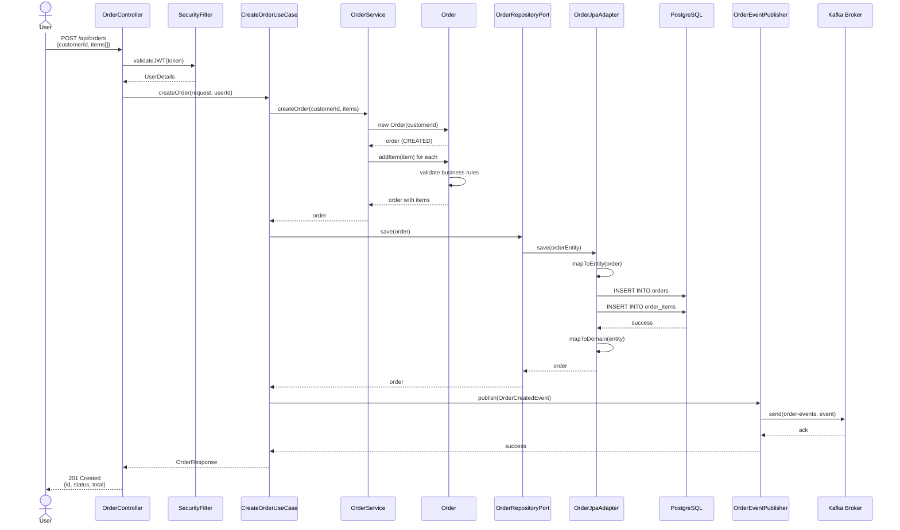
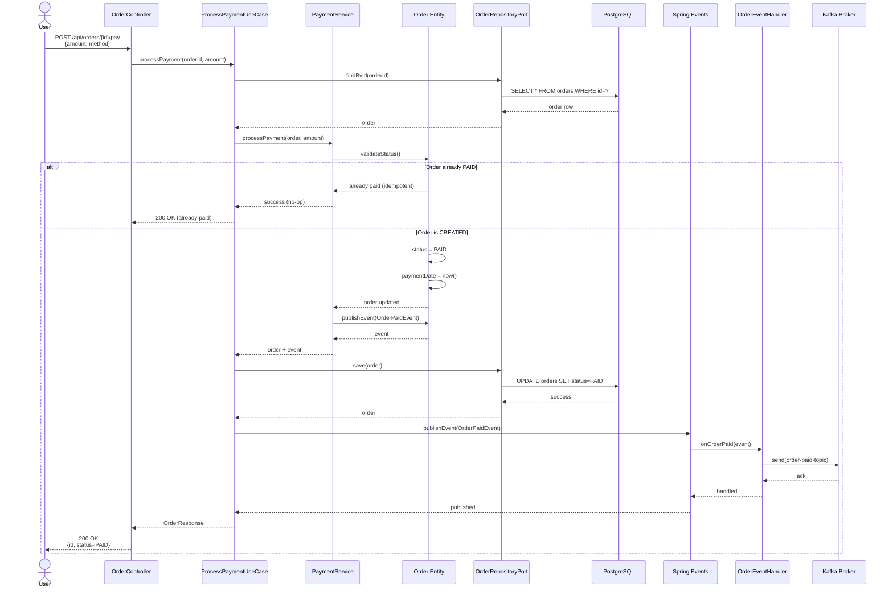
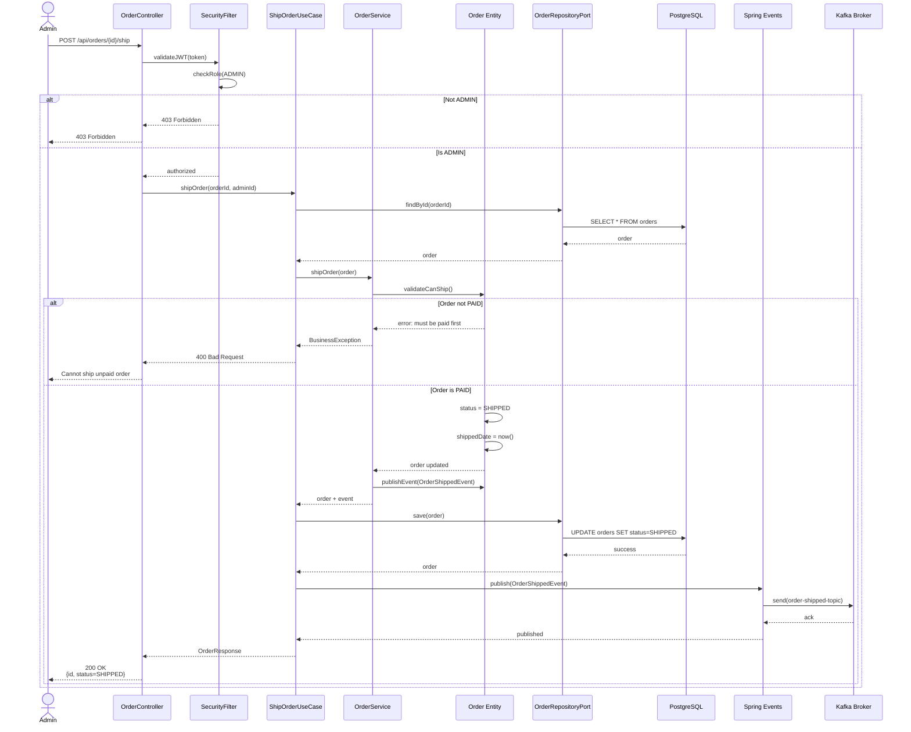
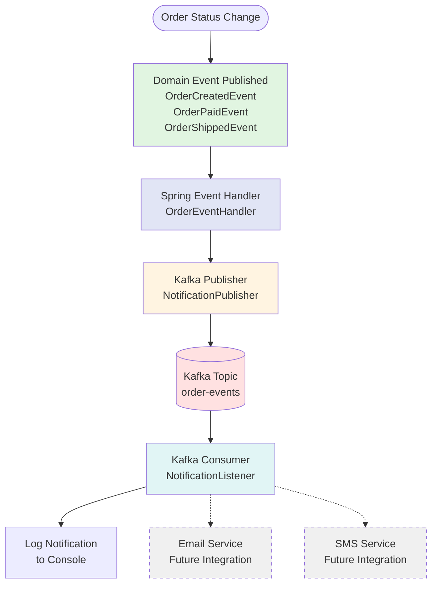
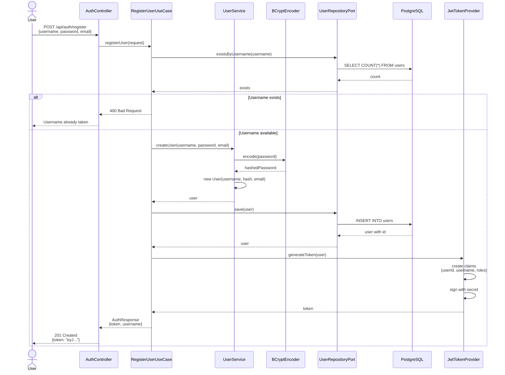

# Data Flow Diagrams

## 1. Order Creation Flow

Complete flow from REST request to database persistence and event publishing.



---

## 2. Payment Processing Flow

Flow showing idempotent payment processing with state validation.



---

## 3. Order Shipping Flow

Admin-only operation with role-based authorization.



---

## 4. Event-Driven Notification Flow

Asynchronous event publishing and consumption.



---

## 5. Authentication Flow

User registration and JWT token generation.



---

## 6. Query Flow (Read Operation)

Optimized read path with minimal layers.

```mermaid
flowchart LR
    User([User])
    REST[OrderController<br/>getOrderById]
    Repo[OrderRepositoryPort]
    JPA[OrderJpaAdapter]
    DB[(PostgreSQL)]
    
    User -->|GET /api/orders/{id}| REST
    REST -->|findById| Repo
    Repo -->|query| JPA
    JPA -->|SELECT| DB
    DB -->|order entity| JPA
    JPA -->|map to domain| Repo
    Repo -->|order| REST
    REST -->|200 OK| User
    
    style User fill:#e1e5f5
    style REST fill:#fff4e1
    style Repo fill:#e1f5e1
    style JPA fill:#ffe1e1
    style DB fill:#f5e1e1
```

---

## Key Data Flow Patterns

### 🔄 Command Flow (Write Operations)
```
REST → UseCase → Domain Service → Entity → Repository → Database
                           ↓
                   Domain Events → Event Handler → Kafka
```

### 📖 Query Flow (Read Operations)
```
REST → Repository → JPA Adapter → Database
```

### 📨 Event Flow (Asynchronous)
```
Domain Event → Spring Event Bus → Handler → Kafka Publisher → Kafka Topic → Consumer
```

### 🔐 Security Flow
```
Request → JWT Filter → Validate Token → Extract User → SecurityContext → Controller
```

---

## Data Transformation Points

### 1. REST → Command (DTO)
```java
CreateOrderRequest (DTO) → CreateOrderCommand (Application)
```

### 2. Command → Domain
```java
CreateOrderCommand → Order Entity (Domain)
```

### 3. Domain → Entity (JPA)
```java
Order (Domain) → OrderEntity (JPA)
```

### 4. Entity → Response
```java
Order (Domain) → OrderResponse (DTO)
```

---

## Error Handling Flow

```mermaid
flowchart TB
    Request[Incoming Request]
    Controller[REST Controller]
    UseCase[Use Case]
    Domain[Domain Service]
    
    BusinessEx[Business Exception<br/>InvalidStateException]
    ValidationEx[Validation Exception<br/>InvalidInputException]
    NotFoundEx[Not Found Exception<br/>EntityNotFoundException]
    
    GlobalHandler[GlobalExceptionHandler<br/>@ControllerAdvice]
    
    ErrorResponse[Error Response<br/>{code, message, timestamp}]
    
    Request --> Controller
    Controller --> UseCase
    UseCase --> Domain
    
    Domain -.-> BusinessEx
    UseCase -.-> NotFoundEx
    Controller -.-> ValidationEx
    
    BusinessEx --> GlobalHandler
    NotFoundEx --> GlobalHandler
    ValidationEx --> GlobalHandler
    
    GlobalHandler --> ErrorResponse
    
    style BusinessEx fill:#ffe1e1
    style ValidationEx fill:#ffe1e1
    style NotFoundEx fill:#ffe1e1
    style GlobalHandler fill:#fff4e1
    style ErrorResponse fill:#e1e5f5
```

---

## Performance Considerations

### Database Queries
- **N+1 Problem Prevention**: Use `@EntityGraph` for order items
- **Pagination**: All list endpoints support page/size parameters
- **Indexing**: Indexes on customerId, status, createdDate

### Event Publishing
- **Asynchronous**: Events published asynchronously via `@Async`
- **Non-blocking**: Kafka producer configured for async sends
- **Resilience**: Retries and circuit breakers on Kafka publisher

### Caching Strategy (Future)
```
GET /api/orders/{id} → Check Cache → Database if miss → Update Cache
```

---

## References
- [Spring Boot Data Flow Best Practices](https://spring.io/guides)
- [Kafka Patterns](https://www.confluent.io/blog/event-driven-architecture-apache-kafka/)
- [Domain Events Pattern](https://martinfowler.com/eaaDev/DomainEvent.html)
