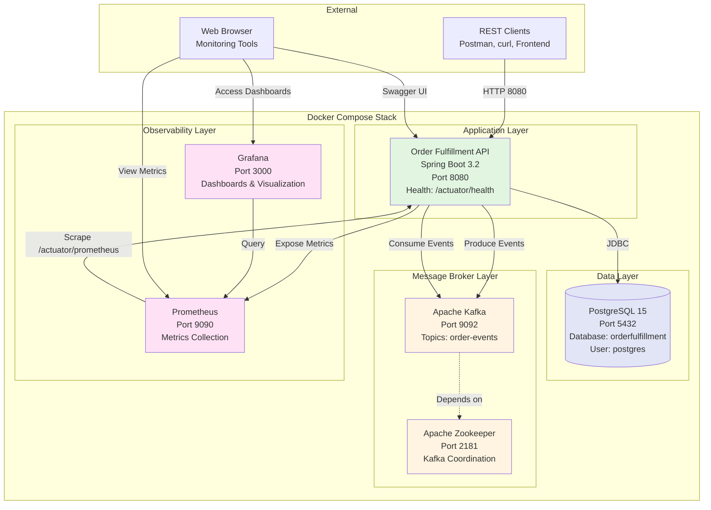
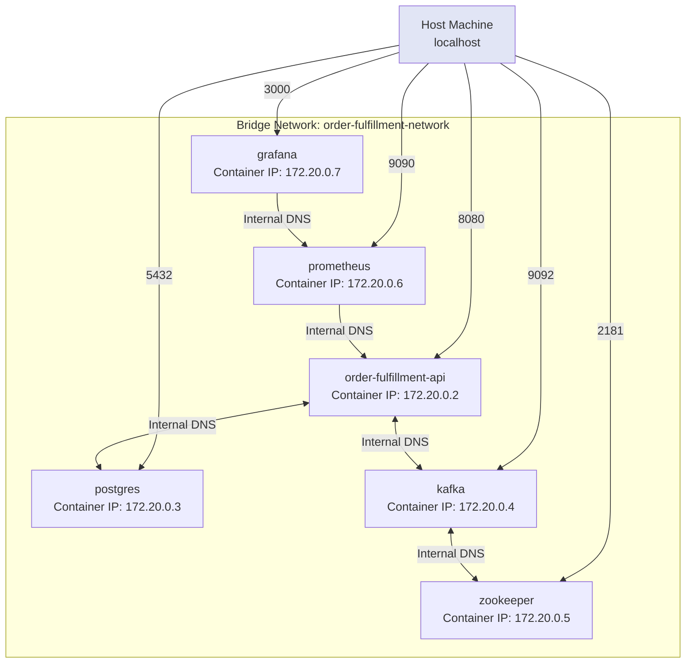
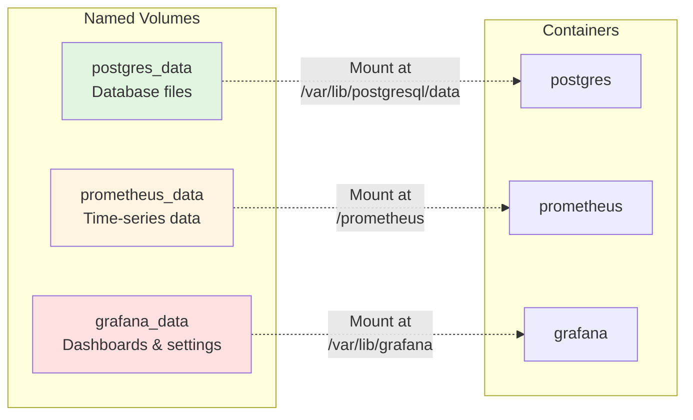
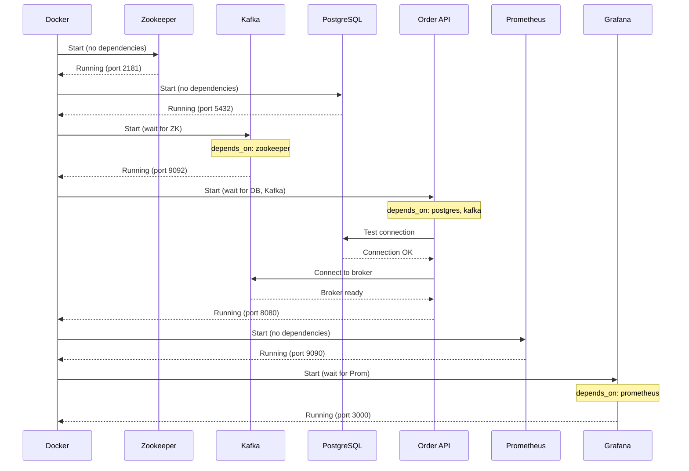
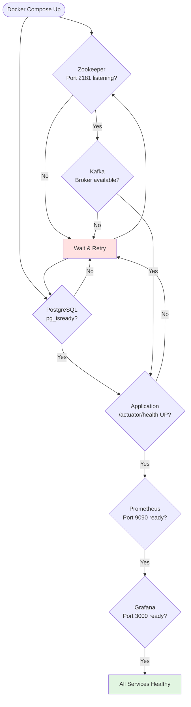
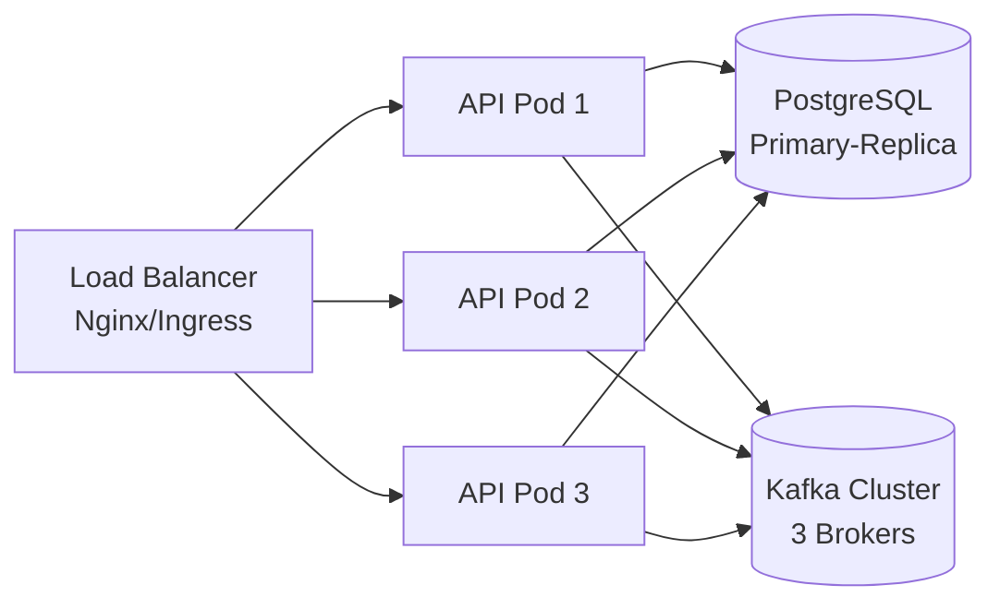

# Deployment Architecture

## Docker Compose Stack

Complete containerized environment for local development and testing.



---

## Container Specifications

### 1. Order Fulfillment Application
```yaml
Service: order-fulfillment-api
Image: Built from Dockerfile
Base: eclipse-temurin:17-jre-alpine
Ports: 8080:8080
Health Check: curl http://localhost:8080/actuator/health
Depends On: postgres, kafka
Environment:
  - SPRING_PROFILES_ACTIVE=docker
  - SPRING_DATASOURCE_URL=jdbc:postgresql://postgres:5432/orderfulfillment
  - SPRING_KAFKA_BOOTSTRAP_SERVERS=kafka:9092
Resources:
  - Memory: 512MB
  - CPU: 0.5 cores
```

### 2. PostgreSQL Database
```yaml
Service: postgres
Image: postgres:15-alpine
Ports: 5432:5432
Environment:
  - POSTGRES_DB=orderfulfillment
  - POSTGRES_USER=postgres
  - POSTGRES_PASSWORD=postgres
Volumes:
  - postgres_data:/var/lib/postgresql/data
Health Check: pg_isready -U postgres
```

### 3. Apache Kafka
```yaml
Service: kafka
Image: confluentinc/cp-kafka:7.5.0
Ports: 9092:9092
Environment:
  - KAFKA_BROKER_ID=1
  - KAFKA_ZOOKEEPER_CONNECT=zookeeper:2181
  - KAFKA_ADVERTISED_LISTENERS=PLAINTEXT://kafka:9092
  - KAFKA_AUTO_CREATE_TOPICS_ENABLE=true
Depends On: zookeeper
```

### 4. Apache Zookeeper
```yaml
Service: zookeeper
Image: confluentinc/cp-zookeeper:7.5.0
Ports: 2181:2181
Environment:
  - ZOOKEEPER_CLIENT_PORT=2181
  - ZOOKEEPER_TICK_TIME=2000
```

### 5. Prometheus
```yaml
Service: prometheus
Image: prom/prometheus:v2.47.0
Ports: 9090:9090
Volumes:
  - ./prometheus.yml:/etc/prometheus/prometheus.yml
  - prometheus_data:/prometheus
Command: --config.file=/etc/prometheus/prometheus.yml
```

### 6. Grafana
```yaml
Service: grafana
Image: grafana/grafana:10.1.0
Ports: 3000:3000
Environment:
  - GF_SECURITY_ADMIN_PASSWORD=admin
Volumes:
  - grafana_data:/var/lib/grafana
Depends On: prometheus
```

---

## Network Architecture



**Network Type:** Bridge (default)  
**Network Name:** `order-fulfillment-network`  
**DNS Resolution:** Automatic via service names  
**Isolation:** All containers in same network can communicate

---

## Volume Management



**Persistence Strategy:**
- ✅ Database state persists across container restarts
- ✅ Prometheus metrics retained on restart
- ✅ Grafana dashboards and datasources saved
- ✅ Application is stateless (no volume needed)

---

## Startup Sequence



**Startup Order:**
1. Zookeeper (independent)
2. PostgreSQL (independent)
3. Kafka (after Zookeeper ready)
4. Order API (after PostgreSQL + Kafka ready)
5. Prometheus (independent)
6. Grafana (after Prometheus ready)

---

## Health Check Strategy



**Health Check Configuration:**
- **Interval:** Every 30 seconds
- **Timeout:** 10 seconds
- **Retries:** 3 attempts
- **Start Period:** 60 seconds grace period

---

## Port Mapping Summary

| Service | Container Port | Host Port | Protocol | Purpose |
|---------|---------------|-----------|----------|---------|
| Order API | 8080 | 8080 | HTTP | REST API & Swagger UI |
| PostgreSQL | 5432 | 5432 | TCP | Database connections |
| Kafka | 9092 | 9092 | TCP | Kafka broker |
| Zookeeper | 2181 | 2181 | TCP | Kafka coordination |
| Prometheus | 9090 | 9090 | HTTP | Metrics queries |
| Grafana | 3000 | 3000 | HTTP | Dashboards |

**Access Points:**
- 🌐 API: http://localhost:8080
- 📚 Swagger: http://localhost:8080/swagger-ui.html
- 🏥 Health: http://localhost:8080/actuator/health
- 📊 Metrics: http://localhost:8080/actuator/prometheus
- 🔍 Prometheus: http://localhost:9090
- 📈 Grafana: http://localhost:3000

---

## Environment Configuration

### Development (docker-compose.yml)
```yaml
environment:
  SPRING_PROFILES_ACTIVE: docker
  SPRING_DATASOURCE_URL: jdbc:postgresql://postgres:5432/orderfulfillment
  SPRING_KAFKA_BOOTSTRAP_SERVERS: kafka:9092
  LOGGING_LEVEL_COM_MIDLEVEL: DEBUG
```

### Production (Future - Kubernetes)
```yaml
environment:
  SPRING_PROFILES_ACTIVE: prod
  SPRING_DATASOURCE_URL: ${DB_CONNECTION_STRING}
  SPRING_KAFKA_BOOTSTRAP_SERVERS: ${KAFKA_BROKERS}
  LOGGING_LEVEL_COM_MIDLEVEL: INFO
  MANAGEMENT_ENDPOINTS_WEB_EXPOSURE_INCLUDE: health,info,prometheus
```

---

## Resource Limits

```yaml
services:
  order-fulfillment-api:
    deploy:
      resources:
        limits:
          cpus: '1.0'
          memory: 512M
        reservations:
          cpus: '0.5'
          memory: 256M
  
  postgres:
    deploy:
      resources:
        limits:
          cpus: '0.5'
          memory: 256M
        reservations:
          cpus: '0.25'
          memory: 128M
  
  kafka:
    deploy:
      resources:
        limits:
          cpus: '1.0'
          memory: 512M
        reservations:
          cpus: '0.5'
          memory: 256M
```

**Total Stack Requirements:**
- **CPU:** ~3 cores
- **Memory:** ~2GB RAM
- **Disk:** ~5GB (with data volumes)

---

## Scaling Strategy (Future)

### Horizontal Scaling (Kubernetes)
```yaml
apiVersion: apps/v1
kind: Deployment
metadata:
  name: order-fulfillment-api
spec:
  replicas: 3  # Multiple instances
  strategy:
    type: RollingUpdate
    rollingUpdate:
      maxSurge: 1
      maxUnavailable: 0
```

### Load Balancing


---

## Deployment Commands

### Start Stack
```bash
# Build and start all services
docker-compose up -d

# Check status
docker-compose ps

# View logs
docker-compose logs -f order-fulfillment-api
```

### Stop Stack
```bash
# Stop all services
docker-compose down

# Stop and remove volumes (clean state)
docker-compose down -v
```

### Rebuild Application
```bash
# Rebuild and restart application only
docker-compose up -d --build order-fulfillment-api
```

### Database Operations
```bash
# Access PostgreSQL
docker-compose exec postgres psql -U postgres -d orderfulfillment

# Backup database
docker-compose exec postgres pg_dump -U postgres orderfulfillment > backup.sql

# Restore database
docker-compose exec -T postgres psql -U postgres orderfulfillment < backup.sql
```

### Kafka Operations
```bash
# List topics
docker-compose exec kafka kafka-topics --list --bootstrap-server localhost:9092

# View messages
docker-compose exec kafka kafka-console-consumer --bootstrap-server localhost:9092 \
  --topic order-events --from-beginning
```

---

## Monitoring & Observability

### Health Checks
```bash
# Application health
curl http://localhost:8080/actuator/health

# Database health
docker-compose exec postgres pg_isready

# Kafka health
docker-compose exec kafka kafka-broker-api-versions \
  --bootstrap-server localhost:9092
```

### Metrics
```bash
# Prometheus metrics
curl http://localhost:8080/actuator/prometheus

# JVM metrics
curl http://localhost:8080/actuator/metrics/jvm.memory.used
```

### Logs
```bash
# Application logs
docker-compose logs -f order-fulfillment-api

# All service logs
docker-compose logs -f

# Last 100 lines
docker-compose logs --tail=100 order-fulfillment-api
```

---

## Future Enhancements

### 🚀 Production Readiness
- [ ] Migrate to Kubernetes (K8s)
- [ ] Add Redis for caching
- [ ] Implement API Gateway (Kong/Ambassador)
- [ ] Add service mesh (Istio/Linkerd)
- [ ] Set up centralized logging (ELK Stack)
- [ ] Implement distributed tracing (Jaeger)

### 🔒 Security
- [ ] TLS/SSL certificates
- [ ] Network policies
- [ ] Secret management (Vault)
- [ ] Container scanning (Trivy)

### 📊 Observability
- [ ] Custom Grafana dashboards
- [ ] Alert rules in Prometheus
- [ ] PagerDuty integration
- [ ] Log aggregation (Elasticsearch)

---

## References
- [Docker Compose Documentation](https://docs.docker.com/compose/)
- [Spring Boot Docker Guide](https://spring.io/guides/topicals/spring-boot-docker/)
- [Kafka Docker Guide](https://kafka.apache.org/quickstart)
- [Prometheus Configuration](https://prometheus.io/docs/prometheus/latest/configuration/configuration/)
