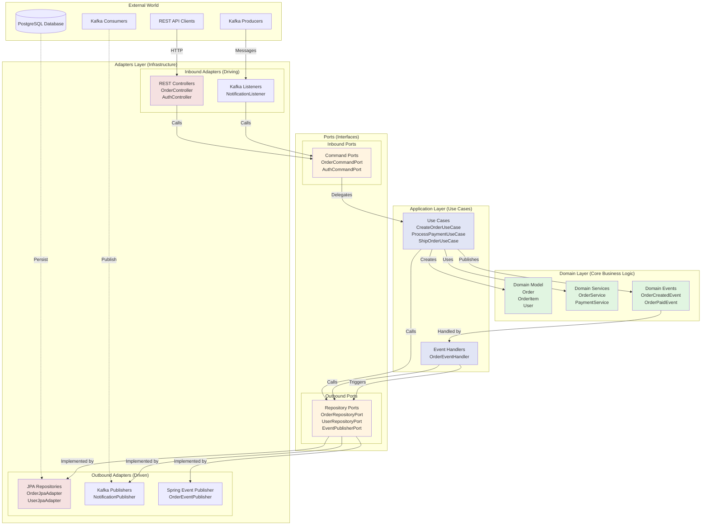
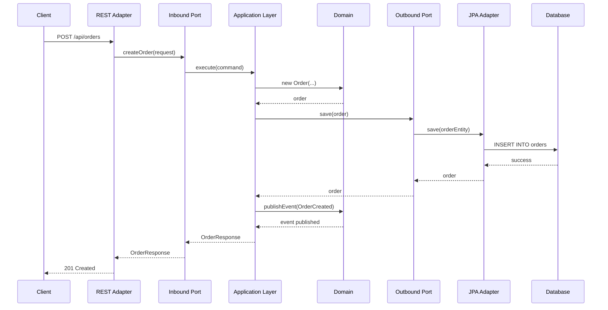

# Hexagonal Architecture Diagram

## Overview
This system follows **Hexagonal Architecture** (Ports & Adapters pattern) to achieve clean separation of concerns, testability, and independence from external frameworks.

## Architecture Visualization



## Layer Responsibilities

### 🎯 Domain Layer (Core)
**Location:** `com.midlevel.orderfulfillment.domain`

**Purpose:** Contains pure business logic with zero framework dependencies

**Components:**
- **Domain Model** (`domain.model`): Entities with rich behavior
  - `Order`: Order aggregate with state transitions
  - `OrderItem`: Value object for line items
  - `User`: User aggregate with authentication
  - `OrderStatus`, `PaymentStatus`: Enumerations
  
- **Domain Services** (`domain.service`): Complex business operations
  - `OrderService`: Order lifecycle management
  - `PaymentService`: Payment processing logic
  
- **Domain Events** (`domain.event`): Business event definitions
  - `OrderCreatedEvent`
  - `OrderPaidEvent`
  - `OrderShippedEvent`
  - `OrderDeliveredEvent`

**Key Principle:** No dependencies on frameworks, databases, or external services

---

### 🔌 Application Layer (Use Cases)
**Location:** `com.midlevel.orderfulfillment.application`

**Purpose:** Orchestrates domain logic and coordinates between adapters

**Components:**
- **Use Cases** (`application.usecase`): Specific user actions
  - `CreateOrderUseCase`: Create new order
  - `ProcessPaymentUseCase`: Process order payment
  - `ShipOrderUseCase`: Mark order as shipped
  - `DeliverOrderUseCase`: Mark order as delivered
  
- **Event Handlers** (`application.event`): React to domain events
  - `OrderEventHandler`: Publishes to Kafka on order events

**Key Principle:** Framework-agnostic orchestration of business logic

---

### 🎭 Adapters Layer (Infrastructure)
**Location:** `com.midlevel.orderfulfillment.adapter`

**Purpose:** Connects external world to domain through ports

#### Inbound Adapters (Driving)
Receive requests from external sources:
- **REST Controllers** (`adapter.rest`): HTTP API endpoints
  - `OrderController`: Order CRUD operations
  - `AuthController`: Authentication endpoints
  
- **Kafka Listeners** (`adapter.messaging.kafka.listener`): Message consumers
  - `NotificationListener`: Consumes notification events

#### Outbound Adapters (Driven)
Implement persistence and external communication:
- **JPA Repositories** (`adapter.persistence.jpa`): Database operations
  - `OrderJpaAdapter`: Implements `OrderRepositoryPort`
  - `UserJpaAdapter`: Implements `UserRepositoryPort`
  
- **Kafka Publishers** (`adapter.messaging.kafka.publisher`): Event publishing
  - `NotificationPublisher`: Publishes to Kafka topics
  
- **Event Publishers** (`adapter.event`): Spring Events
  - `OrderEventPublisher`: Publishes domain events

**Key Principle:** All framework-specific code lives here

---

### 🔗 Ports (Interfaces)
**Location:** `com.midlevel.orderfulfillment.domain.port`

**Purpose:** Define contracts between layers

#### Inbound Ports (API)
Define what the application can do:
- `OrderCommandPort`: Order operations
- `AuthCommandPort`: Authentication operations

#### Outbound Ports (SPI)
Define what the application needs:
- `OrderRepositoryPort`: Order persistence
- `UserRepositoryPort`: User persistence
- `EventPublisherPort`: Event publishing

**Key Principle:** Interfaces owned by domain, implemented by adapters

---

## Dependency Rule

The fundamental rule: **Dependencies point inward**

```
External World → Adapters → Ports → Application → Domain
```

- ✅ Domain depends on **NOTHING**
- ✅ Application depends on **Domain only**
- ✅ Ports depend on **Domain only**
- ✅ Adapters depend on **Ports and Application**
- ❌ Domain **NEVER** depends on Adapters
- ❌ Application **NEVER** depends on Adapters

---

## Benefits Realized

### 🧪 Testability
- Domain logic tested in isolation without database/frameworks
- Use case testing with mock adapters
- Integration tests at adapter boundaries

### 🔄 Flexibility
- Swap PostgreSQL for MongoDB without touching domain
- Replace Kafka with RabbitMQ with minimal changes
- Add GraphQL alongside REST without domain changes

### 🎯 Focus
- Business logic clearly separated from technical concerns
- Easy to understand what the system does (domain layer)
- Infrastructure changes don't ripple through business code

### 📦 Maintainability
- Clear separation of concerns
- Changes localized to specific layers
- New features added without breaking existing code

---

## Example: Order Creation Flow



---

## References
- [Hexagonal Architecture by Alistair Cockburn](https://alistair.cockburn.us/hexagonal-architecture/)
- [Clean Architecture by Robert C. Martin](https://blog.cleancoder.com/uncle-bob/2012/08/13/the-clean-architecture.html)
- [Domain-Driven Design by Eric Evans](https://www.domainlanguage.com/ddd/)
