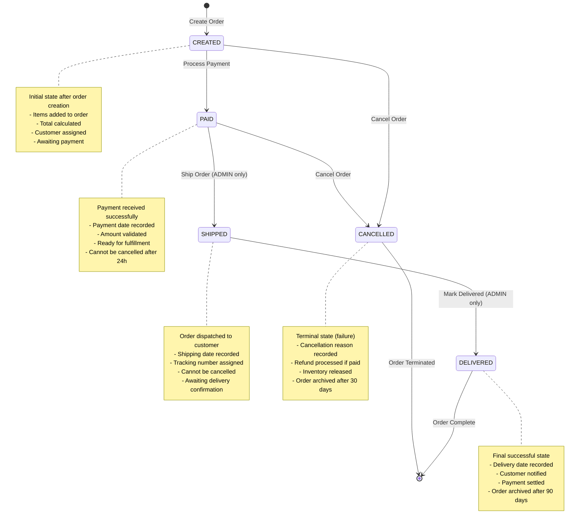
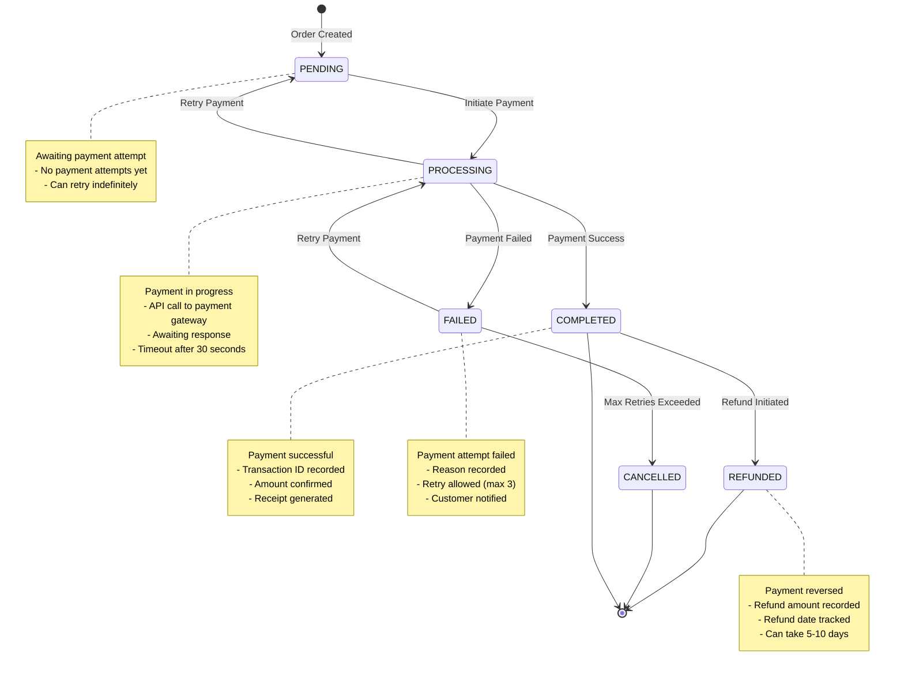
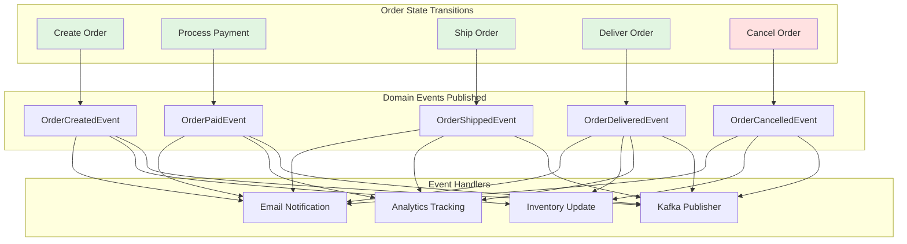

# Order State Machine

## Order Status State Diagram

Complete state transitions for order lifecycle management.



---

## State Transition Rules

### From CREATED

| Action | Target State | Authorization | Conditions | Business Rules |
|--------|-------------|---------------|------------|----------------|
| **Process Payment** | PAID | USER (owner) | - Amount > 0<br/>- Items exist | - Idempotent operation<br/>- Records payment date<br/>- Publishes OrderPaidEvent |
| **Cancel Order** | CANCELLED | USER (owner) or ADMIN | - No payment yet | - Refund not needed<br/>- Inventory released<br/>- Publishes OrderCancelledEvent |

### From PAID

| Action | Target State | Authorization | Conditions | Business Rules |
|--------|-------------|---------------|------------|----------------|
| **Ship Order** | SHIPPED | ADMIN only | - Payment confirmed<br/>- Shipping address valid | - Records shipping date<br/>- Assigns tracking number<br/>- Publishes OrderShippedEvent<br/>- Notifies customer |
| **Cancel Order** | CANCELLED | ADMIN only | - Within 24 hours of payment | - Refund initiated<br/>- Requires approval<br/>- Publishes OrderCancelledEvent |

### From SHIPPED

| Action | Target State | Authorization | Conditions | Business Rules |
|--------|-------------|---------------|------------|----------------|
| **Mark Delivered** | DELIVERED | ADMIN only | - Shipment confirmed<br/>- Delivery signature/proof | - Records delivery date<br/>- Publishes OrderDeliveredEvent<br/>- Notifies customer<br/>- Triggers payment settlement |

### Terminal States

| State | Can Transition? | Archival Policy | Notes |
|-------|-----------------|-----------------|-------|
| **DELIVERED** | ❌ No | Archive after 90 days | Successful completion |
| **CANCELLED** | ❌ No | Archive after 30 days | Failed/terminated |

---

## State Validation Matrix

| Current State | Valid Actions | Invalid Actions |
|--------------|---------------|-----------------|
| **CREATED** | ✅ Pay<br/>✅ Cancel<br/>✅ Update items | ❌ Ship<br/>❌ Deliver |
| **PAID** | ✅ Ship (ADMIN)<br/>✅ Cancel (ADMIN, <24h) | ❌ Pay again<br/>❌ Deliver<br/>❌ Update items |
| **SHIPPED** | ✅ Deliver (ADMIN) | ❌ Cancel<br/>❌ Ship again<br/>❌ Update items |
| **DELIVERED** | ❌ No actions | All actions invalid |
| **CANCELLED** | ❌ No actions | All actions invalid |

---

## Payment Status State Diagram

Separate state machine for payment tracking.



---

## Event Publishing on State Changes

Every state transition publishes a domain event for downstream processing.



---

## State Transition Code Examples

### 1. Create Order (CREATED)
```java
public Order createOrder(String customerId, List<OrderItem> items) {
    Order order = new Order(customerId);
    items.forEach(order::addItem);
    
    // State: CREATED
    Order saved = orderRepository.save(order);
    
    // Publish event
    eventPublisher.publish(new OrderCreatedEvent(saved.getId(), saved.getCustomerId()));
    
    return saved;
}
```

### 2. Process Payment (CREATED → PAID)
```java
public Order processPayment(String orderId, BigDecimal amount) {
    Order order = orderRepository.findById(orderId)
        .orElseThrow(() -> new OrderNotFoundException(orderId));
    
    // Validate state
    if (order.getStatus() == OrderStatus.PAID) {
        return order; // Idempotent: already paid
    }
    
    if (order.getStatus() != OrderStatus.CREATED) {
        throw new InvalidOrderStateException(
            "Cannot pay order in status: " + order.getStatus());
    }
    
    // Validate amount
    if (!order.getTotalAmount().equals(amount)) {
        throw new InvalidPaymentAmountException(
            "Amount mismatch: expected " + order.getTotalAmount());
    }
    
    // Transition state
    order.setStatus(OrderStatus.PAID);
    order.setPaymentDate(LocalDateTime.now());
    Order saved = orderRepository.save(order);
    
    // Publish event
    eventPublisher.publish(new OrderPaidEvent(order.getId(), amount));
    
    return saved;
}
```

### 3. Ship Order (PAID → SHIPPED)
```java
@PreAuthorize("hasRole('ADMIN')")
public Order shipOrder(String orderId, String trackingNumber) {
    Order order = orderRepository.findById(orderId)
        .orElseThrow(() -> new OrderNotFoundException(orderId));
    
    // Validate state
    if (order.getStatus() != OrderStatus.PAID) {
        throw new InvalidOrderStateException(
            "Cannot ship order in status: " + order.getStatus());
    }
    
    // Transition state
    order.setStatus(OrderStatus.SHIPPED);
    order.setShippedDate(LocalDateTime.now());
    order.setTrackingNumber(trackingNumber);
    Order saved = orderRepository.save(order);
    
    // Publish event
    eventPublisher.publish(new OrderShippedEvent(
        order.getId(), trackingNumber, order.getCustomerId()));
    
    return saved;
}
```

### 4. Mark Delivered (SHIPPED → DELIVERED)
```java
@PreAuthorize("hasRole('ADMIN')")
public Order markDelivered(String orderId, String deliveryProof) {
    Order order = orderRepository.findById(orderId)
        .orElseThrow(() -> new OrderNotFoundException(orderId));
    
    // Validate state
    if (order.getStatus() != OrderStatus.SHIPPED) {
        throw new InvalidOrderStateException(
            "Cannot deliver order in status: " + order.getStatus());
    }
    
    // Transition state
    order.setStatus(OrderStatus.DELIVERED);
    order.setDeliveredDate(LocalDateTime.now());
    order.setDeliveryProof(deliveryProof);
    Order saved = orderRepository.save(order);
    
    // Publish event
    eventPublisher.publish(new OrderDeliveredEvent(
        order.getId(), order.getCustomerId()));
    
    return saved;
}
```

### 5. Cancel Order (ANY → CANCELLED)
```java
public Order cancelOrder(String orderId, String reason, String userId) {
    Order order = orderRepository.findById(orderId)
        .orElseThrow(() -> new OrderNotFoundException(orderId));
    
    // Validate state
    if (order.getStatus() == OrderStatus.SHIPPED || 
        order.getStatus() == OrderStatus.DELIVERED) {
        throw new InvalidOrderStateException(
            "Cannot cancel order in status: " + order.getStatus());
    }
    
    // Check authorization
    if (order.getStatus() == OrderStatus.PAID) {
        // Only ADMIN can cancel paid orders
        if (!hasRole(userId, "ADMIN")) {
            throw new UnauthorizedException("Only admins can cancel paid orders");
        }
        
        // Check 24-hour window
        if (Duration.between(order.getPaymentDate(), LocalDateTime.now())
                .toHours() > 24) {
            throw new InvalidOrderStateException(
                "Cannot cancel paid order after 24 hours");
        }
        
        // Initiate refund
        refundService.initiateRefund(order.getId(), order.getTotalAmount());
    }
    
    // Transition state
    order.setStatus(OrderStatus.CANCELLED);
    order.setCancellationReason(reason);
    order.setCancelledDate(LocalDateTime.now());
    Order saved = orderRepository.save(order);
    
    // Publish event
    eventPublisher.publish(new OrderCancelledEvent(
        order.getId(), reason, order.getStatus()));
    
    return saved;
}
```

---

## State Persistence

### Database Schema
```sql
CREATE TABLE orders (
    id UUID PRIMARY KEY,
    customer_id VARCHAR(255) NOT NULL,
    status VARCHAR(20) NOT NULL CHECK (status IN 
        ('CREATED', 'PAID', 'SHIPPED', 'DELIVERED', 'CANCELLED')),
    payment_status VARCHAR(20) CHECK (payment_status IN 
        ('PENDING', 'PROCESSING', 'COMPLETED', 'FAILED', 'REFUNDED', 'CANCELLED')),
    
    -- Timestamps for each state
    created_date TIMESTAMP NOT NULL DEFAULT NOW(),
    payment_date TIMESTAMP,
    shipped_date TIMESTAMP,
    delivered_date TIMESTAMP,
    cancelled_date TIMESTAMP,
    
    -- Additional tracking
    tracking_number VARCHAR(255),
    delivery_proof VARCHAR(500),
    cancellation_reason VARCHAR(500),
    
    -- Audit
    last_modified_date TIMESTAMP NOT NULL DEFAULT NOW(),
    last_modified_by VARCHAR(255),
    
    -- Indexes for querying
    CONSTRAINT status_sequence CHECK (
        (status = 'CREATED' AND payment_date IS NULL) OR
        (status = 'PAID' AND payment_date IS NOT NULL) OR
        (status = 'SHIPPED' AND shipped_date IS NOT NULL) OR
        (status = 'DELIVERED' AND delivered_date IS NOT NULL) OR
        (status = 'CANCELLED' AND cancelled_date IS NOT NULL)
    )
);

-- Index for status-based queries
CREATE INDEX idx_orders_status ON orders(status);
CREATE INDEX idx_orders_customer_status ON orders(customer_id, status);
CREATE INDEX idx_orders_created_date ON orders(created_date);
```

---

## State Query Patterns

### Get Orders by State
```java
// All orders in specific state
List<Order> paidOrders = orderRepository.findByStatus(OrderStatus.PAID);

// Orders in multiple states
List<Order> activeOrders = orderRepository.findByStatusIn(
    Arrays.asList(OrderStatus.CREATED, OrderStatus.PAID, OrderStatus.SHIPPED));
```

### Get Customer Orders with State Filter
```java
// Customer's active orders
List<Order> activeOrders = orderRepository
    .findByCustomerIdAndStatusNot(customerId, OrderStatus.CANCELLED);

// Customer's completed orders
List<Order> completedOrders = orderRepository
    .findByCustomerIdAndStatus(customerId, OrderStatus.DELIVERED);
```

### Time-Based State Queries
```java
// Orders stuck in CREATED for > 24 hours
LocalDateTime threshold = LocalDateTime.now().minusHours(24);
List<Order> staleOrders = orderRepository
    .findByStatusAndCreatedDateBefore(OrderStatus.CREATED, threshold);

// Orders shipped today
LocalDateTime startOfDay = LocalDateTime.now().truncatedTo(ChronoUnit.DAYS);
List<Order> todayShipped = orderRepository
    .findByStatusAndShippedDateAfter(OrderStatus.SHIPPED, startOfDay);
```

---

## State Machine Benefits

### ✅ Business Rule Enforcement
- Prevents invalid state transitions at compile time
- Centralized state logic in domain model
- Clear validation rules for each transition

### 🔍 Audit Trail
- Complete history of state changes
- Timestamps for each state
- Event log for compliance

### 🎯 Predictability
- Finite set of states (5 total)
- Well-defined transitions (8 valid paths)
- Clear terminal states (2)

### 🚀 Extensibility
- Easy to add new states (e.g., REFUNDED, RETURNED)
- Event-driven architecture supports new handlers
- State-specific business logic isolated

---

## Testing State Transitions

### Unit Tests
```java
@Test
void shouldTransitionFromCreatedToPaid() {
    // Given
    Order order = createOrder();
    assertThat(order.getStatus()).isEqualTo(OrderStatus.CREATED);
    
    // When
    order.processPayment(order.getTotalAmount());
    
    // Then
    assertThat(order.getStatus()).isEqualTo(OrderStatus.PAID);
    assertThat(order.getPaymentDate()).isNotNull();
}

@Test
void shouldRejectPaymentOnShippedOrder() {
    // Given
    Order order = createShippedOrder();
    
    // When/Then
    assertThatThrownBy(() -> order.processPayment(100.00))
        .isInstanceOf(InvalidOrderStateException.class)
        .hasMessageContaining("Cannot pay order in status: SHIPPED");
}
```

---

## References
- [State Pattern (Gang of Four)](https://refactoring.guru/design-patterns/state)
- [Finite State Machines](https://brilliant.org/wiki/finite-state-machines/)
- [Domain Events (Martin Fowler)](https://martinfowler.com/eaaDev/DomainEvent.html)
